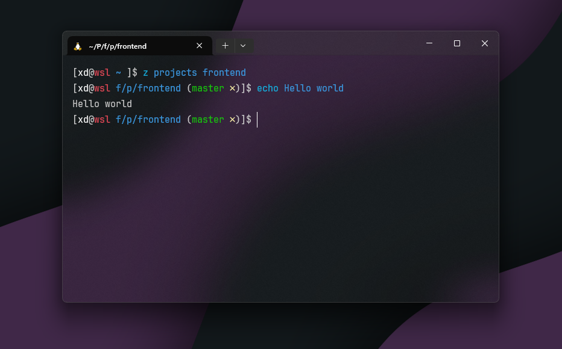

## Clown Fish

Original theme made by [gianu](https://github.com/gianu) for oh-my-zsh, converted to oh-my-fish by [JBarberU](https://github.com/JBarberU). Forked by [josssch](https://github.com/josssch).



## Installation

> [!NOTE]
> I have only tested with the latest version of [Oh My Fish](https://github.com/oh-my-fish/oh-my-fish). Though seemingly abandoned, it is still a great framework for fish.

```fish
omf install https://github.com/josssch/clown-fish
omf theme clown-fish
```

Not in the [packages-main](https://github.com/oh-my-fish/packages-main) repository since it seems that the author is not maintaining it anymore.

## Features

- Username and hostname
- Working directory
  - Working directory relative to the git root
- Git information
